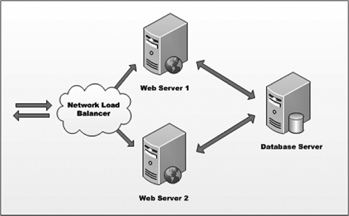
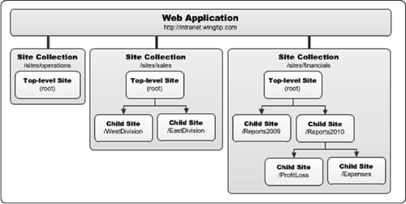
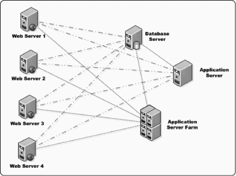

Part 1: Understanding SharePoint
================================
1. [Terms you should be aware of](#terms-you-should-be-aware-of)
1. [Administration Options](#administration-options)
1. [SharePoint Customization / Development / Extensibility Options](#sharePoint-customization-development-extensibility-options)
1. [Resources](#resources)


Terms you should be aware of...
===============================
- Farm
- Web Application
- Tenant / Tenancy
- Site Collection
- Site


Different deployments & hosting options
---------------------------------------
*Briefly... [more on these options later](#sharePoint-deployment-options).*

- On-Premises
- Cloud (Office 365)
- Hosted (FPWeb / Rackspace / Dell / etc)
- Hybrid


DEMO: Exploring SharePoint 2013
-------------------------------
- Team site homepage
- Site Contents
- Site Pages
- Web Parts


SharePoint farms
----------------
- One more more servers with SharePoint install & connected together
- Can be 1, 2 or * servers




SharePoint web application
--------------------------
- Based on IIS web site
- Defines 1+ URL endpoints
- *you'll never have to worry about these*


SharePoint site collections & sites
-----------------------------------
- Site collections are logical things
  - Used to group sites together
  - Single administrator
  - All have a single top-level site with shared resources
- Sites are physical things
  - Browse to these things
  - Container of pages, lists, libraries & other sites
  - This is where the content resides




SharePoint service applications
-------------------------------
- Facilitates sharing resources
  - Content (taxonomies, search indexes)
  - Processing (search crawling, external data access)
- Some can (*and some cannot*) share across SharePoint farms




Administration options
======================
- Central Administration
- Tenant Administration
- Site Settings
- Command Line


Central Administration
----------------------
- Available (*exclusively*) in on-premises deployments
- Central GUI administrative interface for a farm
- Create & manage service applications, web applications & site collections
- Maintain patch level, backup / restore
- Control farm-wide and server-wide settings


Tenant Administration
---------------------
- Similar to Central Administration, but scaled down to manage a specific tenant
- Central GUI administrative interface for a tenant
- Manage service application instances for the tenant
- Create & manage site collections in a tenant
- This is the most control you'll have in Office 365


Site Settings
-------------
- Dual use:
  - Site Collection administration
  - Site administration
- Site settings page for sites...
  - Manage site features
  - Users
  - Lists & libraries
  - Branding for a site (master pages & theme)
- Site settings page for site collection...
  - Extra section added when in top-level site
  - Site collection features
  - Search settings
  - Records management features


Command line
------------
- All controlled via PowerShell
- Enables scripted tasks
- Some operations only available via PowerShell (*not via GUI*)
- Special SharePoint cmdlets added using a special PowerShell snapin:  

  ````powershell
  PS C:\>Add-PSSnapIn Microsoft.SharePoint.PowerShell
  ````

- Special Office 365 administration cmdlets available ([extra download & install](http://technet.microsoft.com/en-us/library/hh974317.aspx))


SharePoint deployment options
=============================
- On-Premises (*aka: on-prem*)
- Cloud (Office 365)
- Hosted
- Hybrid


On-Premises (*aka: on-prem*)
----------------------------
  - Typically single-tenant
  - Manage using Central Administration / command line
  - Full access to all features
  - Deployed on your hardware, you manage everything


Cloud (Office 365)
------------------
  - Microsoft deployed, hosted & managed
  - Pay per user license
  - Most features available


Hosted
------
  - 3rd party deploys, hosts & manages for you
  - Like on-prem, but help in the day-to-day admin
  - Access to all on-prem features, but not O365 features


Hybrid
------
  - On-premises & cloud instances linked together
  - Best of both worlds
  - Varies from customer - to - customer


SharePoint customization extensibility options
==============================================
- Depends on the audience
- Depends on the task / goal
- Tools available:
  - Browser
  - SharePoint Designer
  - Visual Studio


Audience: power user
--------------------
- Browser
- SharePoint Designer
  - Rich-client for SharePoint
  - Workflow & external content type (BCS) designer


Audience: developer
-------------------
- Visual Studio
- SharePoint Solutions
  - Introduced in SharePoint 2007
  - Updated in SharePoint 2010
  - De-emphasized in SharePoint 2013
- SharePoint App Model
  - Introduced in SharePoint 2013
  - Marketplace distribution model
  - Ideal for Office 365


DEMO: key components
====================
Admin sites, IIS Web Sites, File system & Databases


#Resources
- [TechNet: Windows PowerShell cmdlets for Office 365 management and deployment](http://technet.microsoft.com/en-us/library/hh974317.aspx)

[](https://github.com/igrigorik/ga-beacon)