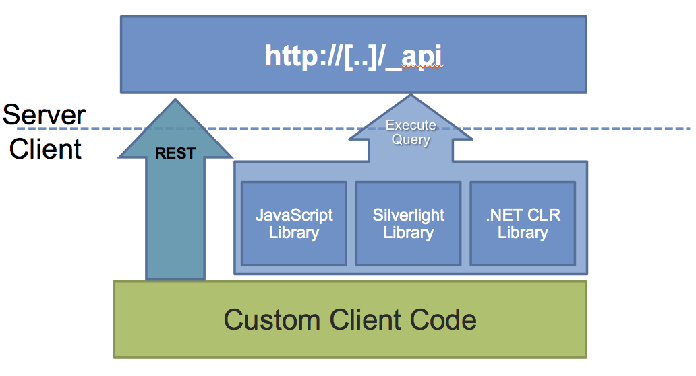

Part 4: Client APIs, App Types & App Security
=============================================
1. [Understanding the SharePoint Client APIs](#understanding-the-sharepoint-client-apis)
1. [App Identity, Security & Permissions](#app-identity-security--permissions)
1. [Brief Look at App Authentication](#brief-look-at-app-authentication)


Understanding the SharePoint Client APIs
========================================
- Two options:
  - Client Side Object Model (aka: CSOM & JSOM)
  - REST API
- Intended use:
  - Client-side solutions residing in the browser
  - Managed code solutions residing off the SharePoint server





Client-side object model
------------------------
- Introduced in SharePoint 2010, improved in SharePoint 2013
- Think of this as a proxy to the client endpoint
- Provided in two types:
  - CSOM: Managed (.NET & Silverlight)
  - JSOM: JavaScript
- Intended uses:
  - .NET applications that need to communicate with SharePoint
  - Developers who don't want to deal with the HTTP plumbing


DEMO: C# & the CSOM
-------------------
Use Windows Console app to demo CSOM - [csom-console](demos/csom-console)


REST API
--------
- Introduced for lists in SharePoint 2010, dramatically improved in SharePoint 2013
- Modeled after the [OData v3 Protocol](http://www.odata.org)
- Available to any technology / infrastructure
- Use well known endpoints to interact with SharePoint
  - Endpoint identifies what you want to interact with (ie: list items)
  - HTTP method identifies what you want do to it (ie: GET, DELETE, POST, etc)
  - HTTP headers identify the authentication, type of data sent & requested and other request describers
  - Submitted data used for CREATE / UPDATE operations


DEMO: JavaScript & the REST API
-------------------------------
Create list & show code to get data: [rest-api-sph](demos/rest-api-sph)


REST API - Get Multiple Items
-----------------------------
````javascript
// get multiple items
var requestUri = _spPageContextInfo.webAbsoluteUrl +
    '/_api/Web/Lists/getByTitle(\'Contacts\')/items/' +
    '?$select=Id,FirstName,Title,Email'

// execute AJAX request 
var requestHeaders = {
  'ACCEPT': 'application/json;odata=verbose'
};

$.ajax({
  url: requestUri,
  contentType: 'application/json;odata=verbose',
  headers: requestHeaders,
  success: function (response){ /* do something on success */ },
  error: function(error){ /* do something on fail */ }
});
````


REST API - Get One Item
-----------------------
````javascript
var requestUri = _spPageContextInfo.webAbsoluteUrl +
    '/_api/Web/Lists/getByTitle(\'Contacts\')/items/' +
    '?$select=Id,FirstName,Title,Email' +
    '&amp;$filter=Id eq 1'

// execute AJAX request 
var requestHeaders = {
  'ACCEPT': 'application/json;odata=verbose'
};

$.ajax({
  url: requestUri,
  contentType: 'application/json;odata=verbose',
  headers: requestHeaders,
  success: function (response){ /* do something on success */ },
  error: function(error){ /* do something on fail */ }
});
````


REST API - Create An Item
-------------------------
````javascript
var requestUri = _spPageContextInfo.webAbsoluteUrl +
          '/_api/Web/Lists/getByTitle(\'Contacts\')/items';

var requestHeaders = {
  'ACCEPT': 'application/json;odata=verbose',
  'X-REQUESTDIGEST': $('#__REQUESTDIGEST').val()
};

var customerData = {
  __metadata: { 'type': 'SP.Data.ContactsListItem' },
  Title: 'Brand New Item',
};

requestBody = JSON.stringify(customerData);

$.ajax({
  url: requestUri,
  type: 'POST',
  contentType: 'application/json;odata=verbose',
  headers: requestHeaders,
  data: JSON.stringify(customerData);,
  success: function (response){ /* do something on success */ },
  error: function(error){ /* do something on fail */ }
});
````


REST API - Update An Item
-------------------------
````javascript
var requestUri = _spPageContextInfo.webAbsoluteUrl +
          '/_api/Web/Lists/getByTitle(\'Contacts\')/items(1)';

var requestHeaders = {
  'ACCEPT': 'application/json;odata=verbose',
  'X-REQUESTDIGEST': $('#__REQUESTDIGEST').val(),
  'X-HTTP-METHOD': 'MERGE',
  'IF-MATCH': etag
};

var customerData = {
  __metadata: { 'type': 'SP.Data.ContactsListItem' },
  Title: 'NewName',
};

requestBody = JSON.stringify(customerData);

$.ajax({
  url: requestUri,
  type: 'POST',
  contentType: 'application/json;odata=verbose',
  headers: requestHeaders,
  data: JSON.stringify(customerData);,
  success: function (response){ /* do something on success */ },
  error: function(error){ /* do something on fail */ }
});
````


REST API - Delete An Item
-------------------------
````javascript
var requestUri = _spPageContextInfo.webAbsoluteUrl +
          '/_api/Web/Lists/getByTitle(\'Contacts\')/items(1)';

var requestHeaders = {
  'ACCEPT': 'application/json;odata=verbose',
  'X-REQUESTDIGEST': $('#__REQUESTDIGEST').val(),
  'IF-MATCH': '*'
};

$.ajax({
  url: requestUri,
  type: 'DELETE',
  headers: requestHeaders,
  success: function (response){ /* do something on success */ },
  error: function(error){ /* do something on fail */ }
});
````


CSOM & REST API compared
------------------------


###CSOM is better than REST because...
- Can do more - some things not supported in REST API yet (ie: workflow)
- Write less code because you don't do HTTP plumbing code
- Supports batching requests
- Develop against a strongly typed API


###REST API is better than CSOM because...
- Full control over the HTTP calls
- More web-standards friendly
- Not limited to .NET or JavaScript in the browser
- Data returned as raw collections => friendly to 3rd party libraries
- Microsoft *seems* to be favoring this going forward
- *AC prefers it 9 our of 10 times you ask him*


App Identity, Security & Permissions
====================================
- App Authentication
- App Security & Permissions


App Authentication
------------------
- Two types
  - Internal authentication
  - External authentication


###Internal authentication
- Used if incoming call: 
  - targets CSOM / REST API
  - includes claims token with established user identity
  - targets URL of an existing AppWeb
- Nothing to setup... it just works!
- Always used when making client-side calls
  - Apps can't authenticate in JavaScript... can't protect clientSecret / certificate
- App only permissions not supported / possible


###External authentication
- Used when server-side code used to call CSOM / REST API
- Incoming calls can target HostWeb & other sites
- Incoming calls include OAuth2 access token, identifying app
  - Optionally also include user identity


App Permissions are not like user permissions
---------------------------------------------
- User permissions are hierarchal (inherit by default)
- App permissions are not hierarchal
- Apps must be granted explicit permissions


SharePoint 2013 authentication flow
-----------------------------------


Types of permissions
--------------------
- User Only
  - More *legacy* option & how all non-app part of SharePoint
- User + App
  - Both the user & app must be granted permissions to do the requested operation
- App Only
  - Only the app needs permissions to do the requested operation
  - User permissions are not checked


Brief Look at app authentication implementation
-----------------------------------------------
- App authentication founded on OAuth2 protocol
- Apps need a username & password
  - Username = client ID
  - Password = client secret / certificate
- Upon successful authentication, receive OAuth access token


Obtaining an access token
-------------------------
- Two options for obtaining access token
  - 3-legged: what Office 365 SharePoint Online uses
  - 2-legged: what SharePoint on-premises uses
- High-trust / Server-to-Server (S2S) trust apps
  - Used in the 2-legged approach
  - SSL certificates used to establish trust between app & SharePoint
  - Not available in Office 365